# Sentinel AI — AI Workflow Documentation

## LangGraph Agent Architecture, Gemini Integration & RAG Pipeline

---

## 1. AI System Overview

Sentinel AI's intelligence layer is built on a **multi-agent architecture** powered by LangGraph for orchestration and Google's Gemini API for natural language reasoning. The system employs seven specialist agents coordinated by a central orchestrator through a state-machine workflow.

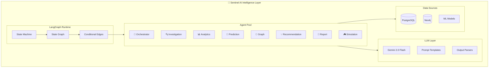

---

## 2. LangGraph Architecture

### 2.1 Core Concepts

LangGraph models agent workflows as **directed state graphs** where:
- **Nodes** represent processing steps (agent functions)
- **Edges** define transitions between steps
- **State** flows through the graph as a shared TypedDict
- **Conditional edges** enable dynamic routing based on state

### 2.2 Agent State Schema

The shared state that flows through all agents:

```python
from typing import TypedDict, Optional

class AgentState(TypedDict):
    """Shared state flowing through the LangGraph agent pipeline."""
    # Input
    messages: list                          # Conversation history
    query: str                              # Original user query
    
    # Routing
    intent: str                             # Classified intent
    target_agents: list[str]                # Agents to invoke
    
    # Data context
    crime_data: Optional[list[dict]]        # Crime records from PostgreSQL
    graph_data: Optional[dict]              # Relationships from Neo4j
    
    # Agent outputs
    investigation_results: Optional[dict]   # Investigation agent output
    analytics_results: Optional[dict]       # Analytics agent output
    ml_predictions: Optional[dict]          # Prediction agent output
    graph_analysis: Optional[dict]          # Graph agent output
    recommendations: Optional[list[dict]]   # Recommendation agent output
    simulation_results: Optional[dict]      # Simulation agent output
    report_data: Optional[dict]             # Report agent output
    
    # Final output
    final_response: Optional[str]           # Aggregated response
    errors: list[str]                       # Error tracking
    metadata: dict                          # Processing metadata
```

### 2.3 Orchestrator State Machine

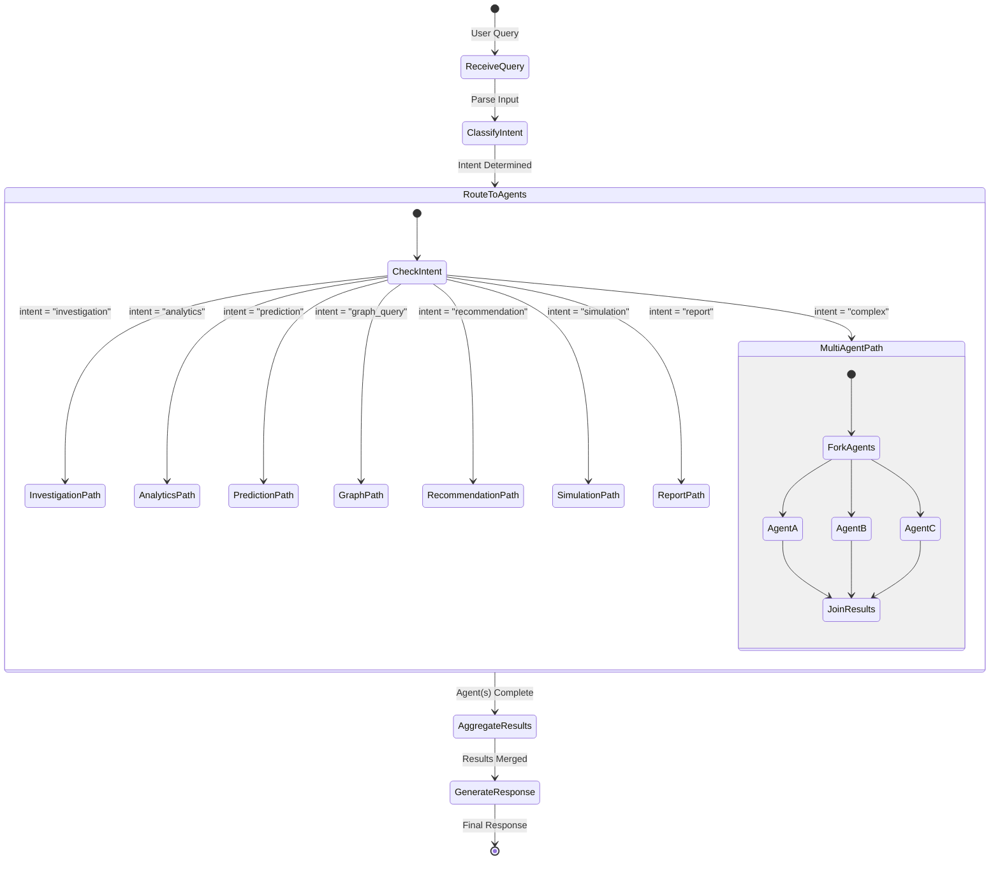

### 2.4 LangGraph Graph Construction

```python
from langgraph.graph import StateGraph, END

def build_orchestrator_graph() -> StateGraph:
    """Build the master orchestrator LangGraph."""
    
    graph = StateGraph(AgentState)
    
    # Add nodes (processing steps)
    graph.add_node("classify_intent", classify_intent_node)
    graph.add_node("investigation", investigation_node)
    graph.add_node("analytics", analytics_node)
    graph.add_node("prediction", prediction_node)
    graph.add_node("graph_query", graph_query_node)
    graph.add_node("recommendation", recommendation_node)
    graph.add_node("simulation", simulation_node)
    graph.add_node("report", report_node)
    graph.add_node("aggregate", aggregate_results_node)
    graph.add_node("respond", generate_response_node)
    
    # Set entry point
    graph.set_entry_point("classify_intent")
    
    # Add conditional routing
    graph.add_conditional_edges(
        "classify_intent",
        route_to_agent,           # Routing function
        {
            "investigation": "investigation",
            "analytics": "analytics",
            "prediction": "prediction",
            "graph_query": "graph_query",
            "recommendation": "recommendation",
            "simulation": "simulation",
            "report": "report",
        }
    )
    
    # All agents flow to aggregation
    for agent in ["investigation", "analytics", "prediction", 
                   "graph_query", "recommendation", "simulation", "report"]:
        graph.add_edge(agent, "aggregate")
    
    graph.add_edge("aggregate", "respond")
    graph.add_edge("respond", END)
    
    return graph.compile()
```

---

## 3. Individual Agent Workflows

### 3.1 Investigation Agent

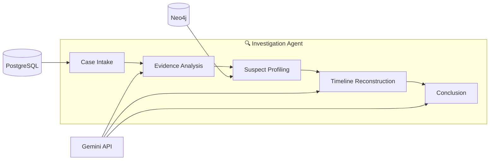

| Node | Function | Data Sources | LLM Usage |
|---|---|---|---|
| Case Intake | Load case data, evidence, suspects | PostgreSQL | None |
| Evidence Analysis | Analyze evidence patterns and connections | Agent state | Gemini: pattern reasoning |
| Suspect Profiling | Build suspect profiles with relationships | Neo4j | Gemini: profile narrative |
| Timeline Reconstruction | Build chronological event timeline | Agent state | Gemini: temporal reasoning |
| Conclusion | Synthesize findings into report | All results | Gemini: synthesis + summary |

### 3.2 Analytics Agent

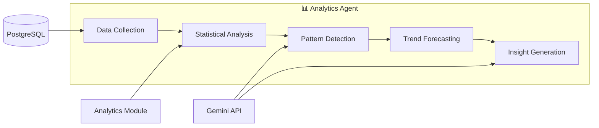

### 3.3 Prediction Agent

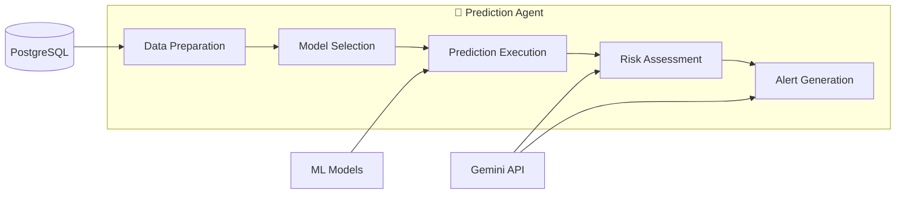

### 3.4 Graph Agent

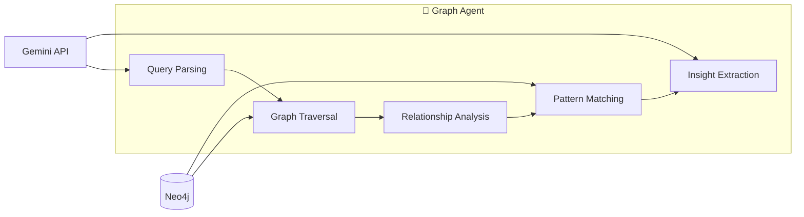

### 3.5 Recommendation Agent

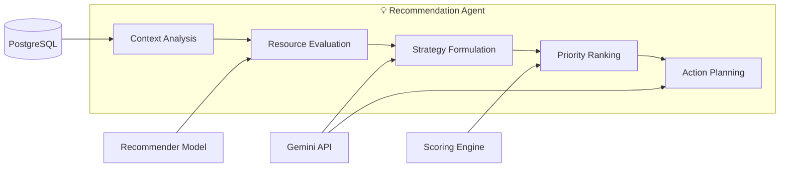

### 3.6 Report Agent

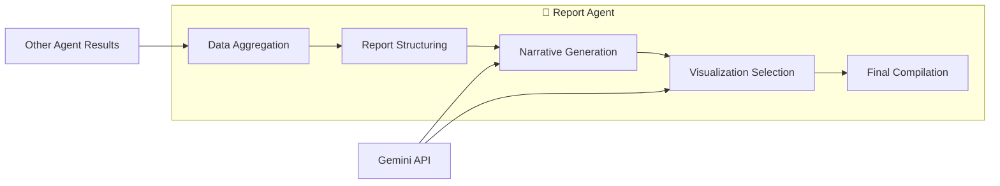

### 3.7 Simulation Agent

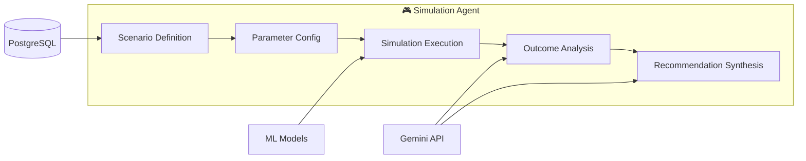

---

## 4. Gemini API Integration

### 4.1 Integration Architecture

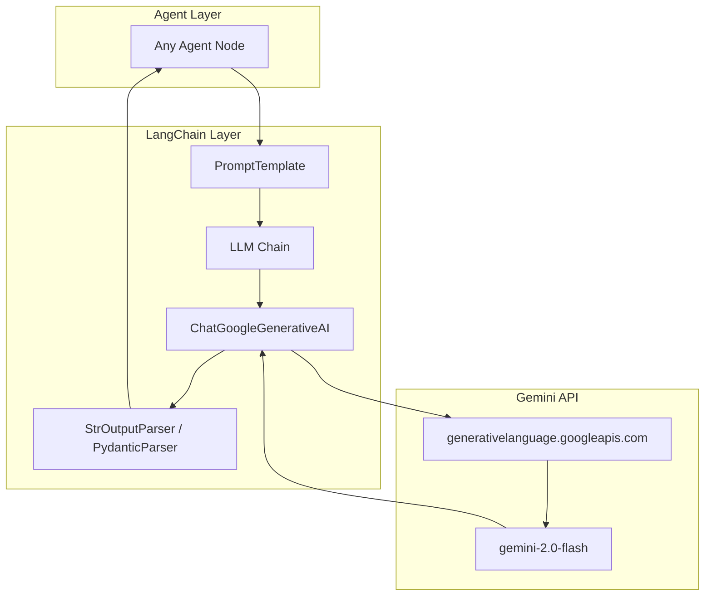

### 4.2 LLM Configuration Per Agent

| Agent | Model | Temperature | Max Tokens | Purpose |
|---|---|---|---|---|
| Orchestrator | gemini-2.0-flash | 0.1 | 1024 | Intent classification (deterministic) |
| Investigation | gemini-2.0-flash | 0.2 | 4096 | Evidence analysis (precise) |
| Analytics | gemini-2.0-flash | 0.3 | 2048 | Insight generation (balanced) |
| Prediction | gemini-2.0-flash | 0.2 | 2048 | Risk assessment (precise) |
| Graph | gemini-2.0-flash | 0.2 | 2048 | Relationship interpretation (precise) |
| Recommendation | gemini-2.0-flash | 0.4 | 2048 | Strategy formulation (creative) |
| Report | gemini-2.0-flash | 0.5 | 8192 | Narrative generation (creative) |
| Simulation | gemini-2.0-flash | 0.6 | 4096 | Scenario analysis (exploratory) |

### 4.3 Prompt Engineering Strategy

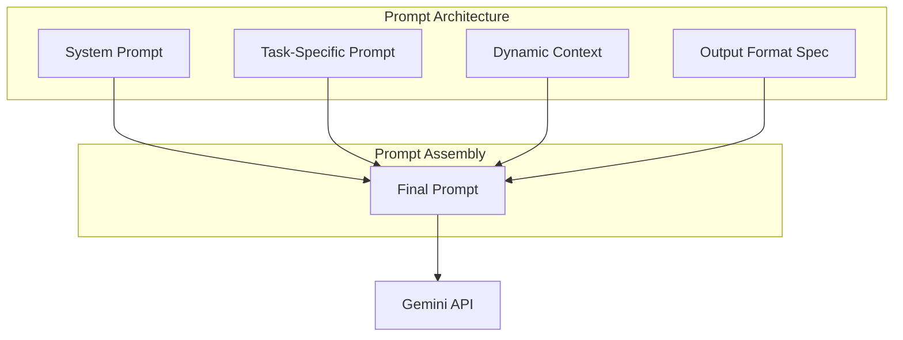

**Prompt Template Structure**:

```
SYSTEM: {system_prompt}
    - Role definition for the agent
    - Behavioral constraints
    - Domain expertise context

TASK: {task_prompt}
    - Specific operation to perform
    - Step-by-step instructions

CONTEXT: {dynamic_context}
    - Crime data from database
    - Previous agent outputs
    - User conversation history

FORMAT: {output_format}
    - Expected JSON structure
    - Required fields
    - Example output
```

---

## 5. RAG (Retrieval-Augmented Generation) Pipeline

### 5.1 RAG Architecture

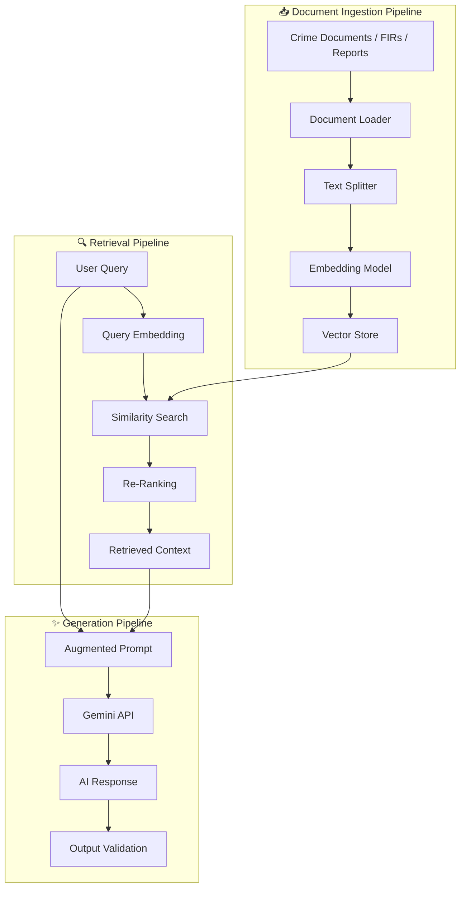

### 5.2 RAG Configuration

| Parameter | Value | Rationale |
|---|---|---|
| Chunk Size | 1000 characters | Balance between context and specificity |
| Chunk Overlap | 200 characters | Maintain context across chunk boundaries |
| Top-K Retrieval | 5 documents | Enough context without overwhelming LLM |
| Similarity Metric | Cosine similarity | Standard for text embeddings |
| Re-Ranking | Cross-encoder | Improve relevance of retrieved chunks |

### 5.3 RAG Data Sources

| Source | Content | Usage |
|---|---|---|
| Crime Records | FIR descriptions, case narratives | Investigation context |
| Legal Documents | IPC sections, criminal procedure codes | Legal reference |
| Historical Reports | Past investigation reports | Pattern matching |
| Suspect Profiles | Known criminal descriptions | Suspect identification |
| Operational SOPs | Standard operating procedures | Recommendation context |

---

## 6. Agent Communication Protocol

### 6.1 Communication Flow

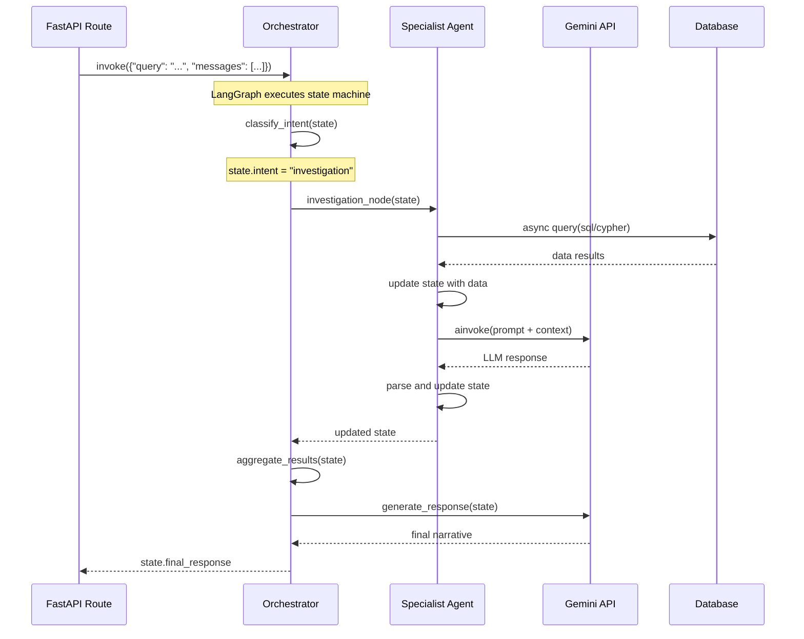

### 6.2 Inter-Agent Data Sharing

Agents share data through the state graph — each agent reads from and writes to specific state fields:

```mermaid
graph TD
    subgraph State["AgentState (Shared Memory)"]
        Query[query]
        Intent[intent]
        CrimeData[crime_data]
        GraphData[graph_data]
        InvResults[investigation_results]
        AnaResults[analytics_results]
        MLPred[ml_predictions]
        GraphAnalysis[graph_analysis]
        Recs[recommendations]
        SimResults[simulation_results]
        Report[report_data]
        Final[final_response]
    end

    Orch[Orchestrator] -->|writes| Intent
    Orch -->|reads| Final

    InvAgent[Investigation] -->|reads| CrimeData
    InvAgent -->|reads| GraphData
    InvAgent -->|writes| InvResults

    AnaAgent[Analytics] -->|reads| CrimeData
    AnaAgent -->|writes| AnaResults

    PredAgent[Prediction] -->|reads| CrimeData
    PredAgent -->|writes| MLPred

    GraphAgent[Graph] -->|reads| Query
    GraphAgent -->|writes| GraphAnalysis

    RecAgent[Recommendation] -->|reads| MLPred
    RecAgent -->|reads| AnaResults
    RecAgent -->|writes| Recs

    RepAgent[Report] -->|reads all| InvResults
    RepAgent -->|reads all| AnaResults
    RepAgent -->|reads all| MLPred
    RepAgent -->|writes| Report

    SimAgent[Simulation] -->|reads| MLPred
    SimAgent -->|reads| CrimeData
    SimAgent -->|writes| SimResults
```

---

## 7. Crime Simulation Engine

### 7.1 Simulation Architecture

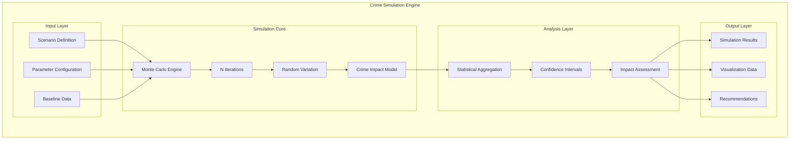

### 7.2 Simulation Types

| Simulation Type | Description | Key Parameters |
|---|---|---|
| **Resource Reallocation** | Model impact of moving officers between zones | officer_delta, source_zone, target_zone |
| **Patrol Frequency** | Model impact of changing patrol frequency | frequency_multiplier, target_zones |
| **Crime Prevention** | Model impact of preventive interventions | intervention_type, coverage_area |
| **Temporal Analysis** | Model crime changes across time periods | time_horizon, seasonal_factors |

### 7.3 Monte Carlo Process

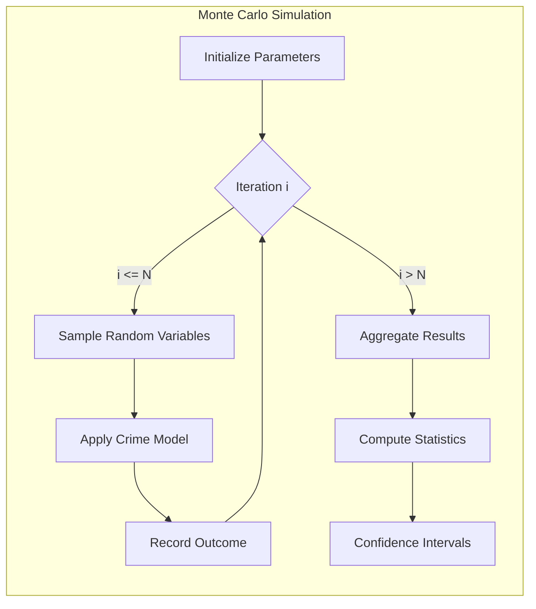

---

## 8. Officer Recommendation Engine

### 8.1 Recommendation Architecture

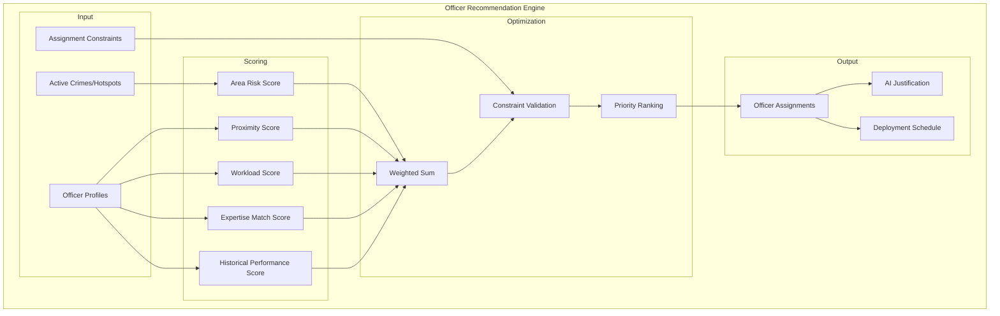

### 8.2 Scoring Formula

```
CompositeScore(officer, area) = 
    w_risk × RiskScore(area) +
    w_proximity × ProximityScore(officer, area) +
    w_workload × (1 - WorkloadScore(officer)) +
    w_expertise × ExpertiseMatch(officer, area.crime_types) +
    w_history × PerformanceScore(officer)

Where:
    w_risk = 0.30
    w_proximity = 0.20
    w_workload = 0.20
    w_expertise = 0.20
    w_history = 0.10
```

---

## 9. Error Handling in AI Pipeline

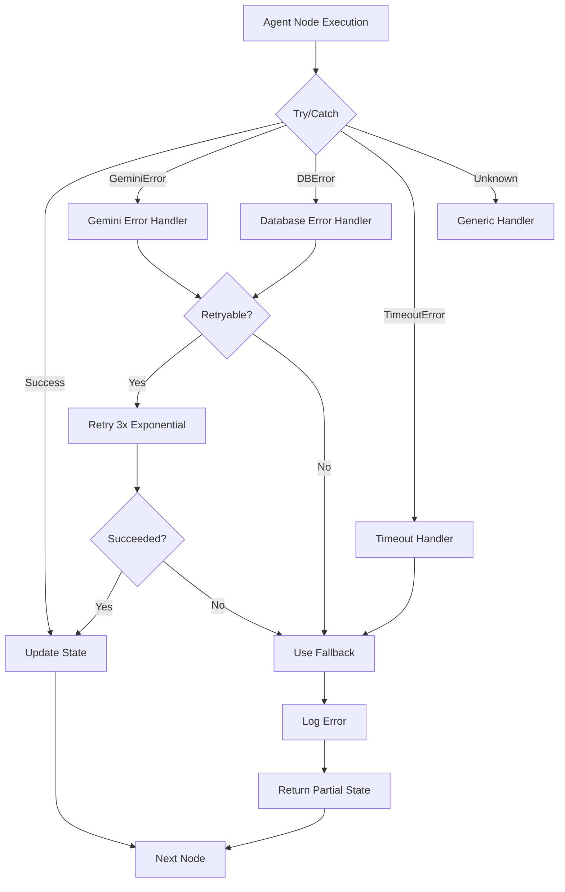

---

## 10. Performance Optimization

| Optimization | Implementation | Impact |
|---|---|---|
| **Async I/O** | `asyncio` throughout agent pipeline | Non-blocking DB and API calls |
| **Parallel Agent Execution** | LangGraph parallel nodes for multi-agent queries | Reduced total latency |
| **Prompt Caching** | Cache compiled prompt templates | Faster prompt assembly |
| **Connection Pooling** | Persistent DB connection pools | Reduced connection overhead |
| **Model Caching** | Lazy-load ML models on first use | Faster cold start |
| **Response Streaming** | Stream LLM tokens for real-time UI | Improved UX |

---

*Sentinel AI — Intelligent Agents, Unified Intelligence*
