# Sentinel AI — System Architecture

## Comprehensive Architecture Documentation

---

## 1. Architecture Overview

Sentinel AI follows a **layered microservices-inspired architecture** with clear separation of concerns. The system is designed around four primary layers, each with well-defined responsibilities and interfaces.

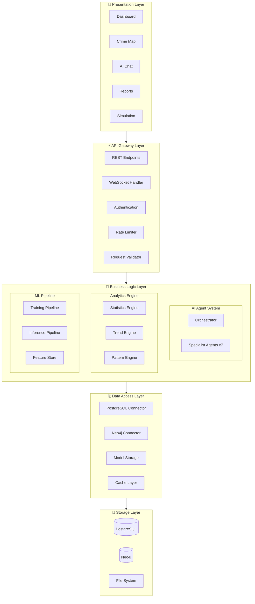

---

## 2. Layer Architecture

### 2.1 Presentation Layer (Frontend)

**Technology**: Next.js 14, React 18, TypeScript, Tailwind CSS

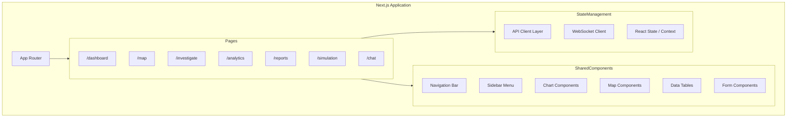

**Key Design Decisions**:

| Decision | Choice | Rationale |
|---|---|---|
| Rendering | Server-side (SSR) | SEO + fast initial load for dashboards |
| State | React Context + local state | Sufficient for dashboard app, no Redux overhead |
| API Communication | Fetch API + WebSocket | REST for CRUD, WebSocket for real-time chat |
| Styling | Tailwind CSS | Rapid development, consistent design system |
| Charts | Recharts | React-native charting, lightweight |
| Maps | Leaflet | Open-source, no API key required |

---

### 2.2 API Gateway Layer (Backend)

**Technology**: FastAPI, Python 3.11+, Uvicorn

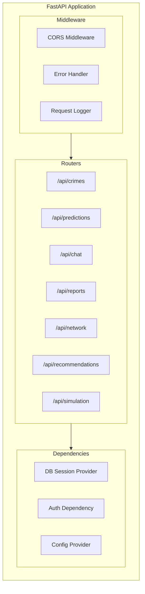

**API Design Principles**:

- **RESTful conventions**: Standard HTTP methods, proper status codes, consistent response schemas
- **Async-first**: All route handlers are `async def` for non-blocking I/O
- **Dependency Injection**: FastAPI's `Depends()` for database sessions, auth, and config
- **Pydantic Models**: Request/response validation with Pydantic v2
- **Error Handling**: Global exception handlers with structured error responses
- **CORS**: Configured for frontend origin in development and production

**Endpoint Architecture**:

| Router | Method | Endpoint | Description |
|---|---|---|---|
| `crimes` | GET | `/api/crimes` | List crimes with filters |
| | GET | `/api/crimes/{id}` | Get crime details |
| | POST | `/api/crimes` | Create crime record |
| `predictions` | GET | `/api/predictions/hotspots` | Get hotspot predictions |
| | GET | `/api/predictions/forecast` | Get crime forecasts |
| | GET | `/api/predictions/anomalies` | Get detected anomalies |
| `chat` | POST | `/api/chat` | Send message to AI system |
| | WebSocket | `/api/chat/ws` | Real-time AI conversation |
| `reports` | GET | `/api/reports` | List generated reports |
| | POST | `/api/reports/generate` | Generate new report |
| `network` | GET | `/api/network/graph` | Get criminal network graph |
| | GET | `/api/network/entity/{id}` | Get entity relationships |
| `recommendations` | GET | `/api/recommendations/officers` | Get officer recommendations |
| | GET | `/api/recommendations/patrols` | Get patrol route suggestions |
| `simulation` | POST | `/api/simulation/run` | Run crime simulation |
| | GET | `/api/simulation/{id}` | Get simulation results |

---

### 2.3 Business Logic Layer

This layer contains the core intelligence of Sentinel AI, divided into three sub-systems.

#### 2.3.1 AI Agent System (LangGraph + Gemini)

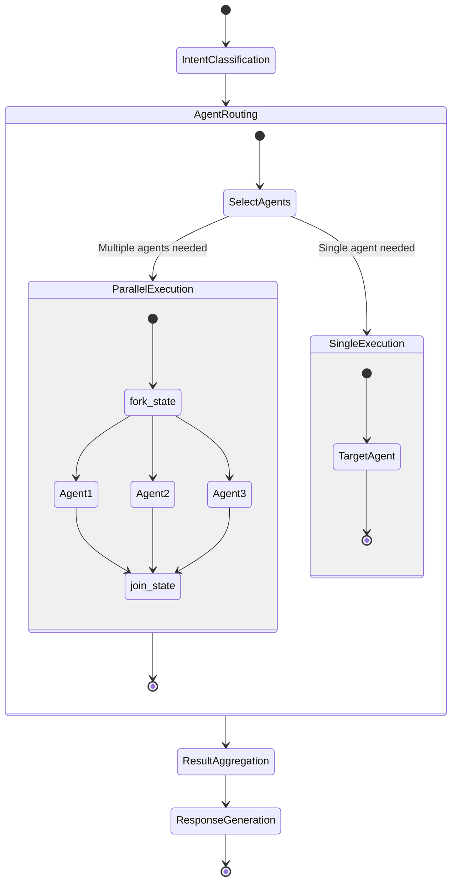

**Agent Communication Protocol**:

Each agent operates as a LangGraph node within a state machine. Agents communicate through a shared `AgentState` (TypedDict) that flows through the graph:

```python
class AgentState(TypedDict):
    messages: list              # Conversation history
    query: str                  # User query
    intent: str                 # Classified intent
    context: dict               # Shared context data
    crime_data: list            # Crime records from PostgreSQL
    graph_data: dict            # Relationships from Neo4j
    ml_predictions: dict        # ML model outputs
    analytics_results: dict     # Analytics computations
    recommendations: list       # Resource recommendations
    simulation_results: dict    # Simulation outputs
    report: dict                # Generated report data
    errors: list                # Error tracking
    metadata: dict              # Processing metadata
```

**Agent Responsibilities**:

| Agent | Input | Processing | Output |
|---|---|---|---|
| **Orchestrator** | User query | Intent classification, agent routing | Aggregated response |
| **Investigation** | Case ID / evidence | Evidence analysis, timeline reconstruction | Investigation report |
| **Analytics** | Crime data filters | Statistical analysis, pattern detection | Analytics insights |
| **Prediction** | Location / time range | ML model invocation, risk assessment | Predictions + risk scores |
| **Graph** | Entity IDs / query | Neo4j traversal, network analysis | Relationship maps |
| **Recommendation** | Constraints / context | Scoring, optimization | Officer assignments |
| **Report** | Multi-agent results | Data aggregation, narrative generation | Structured report |
| **Simulation** | Scenario parameters | Monte Carlo simulation, impact modeling | Scenario outcomes |

#### 2.3.2 Analytics Engine

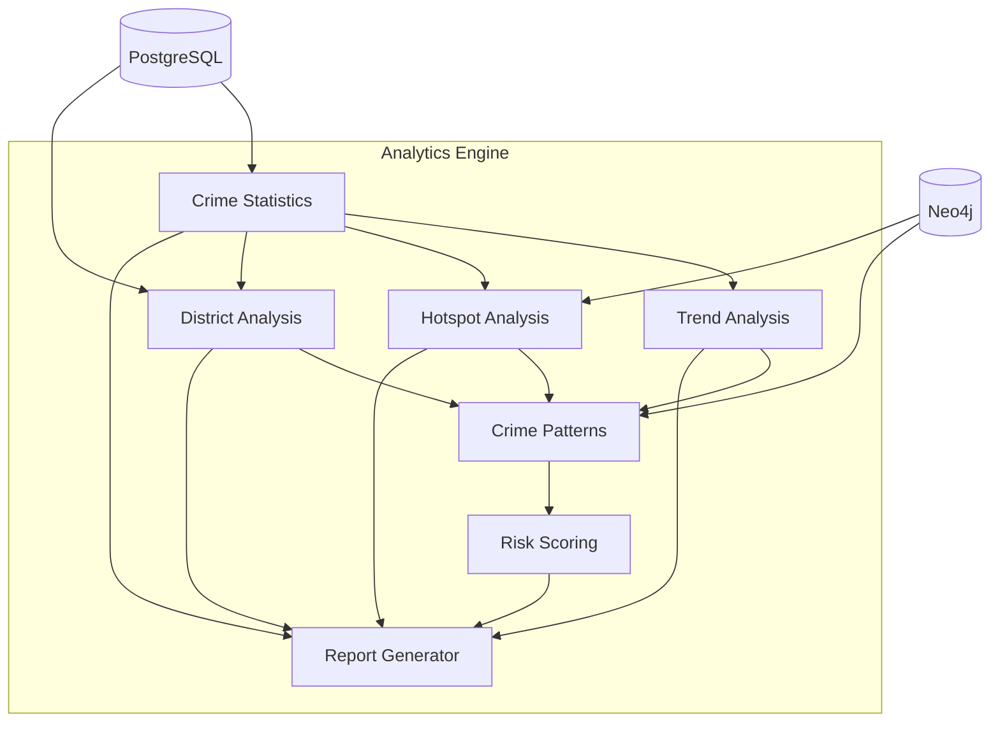

| Module | Data Source | Key Operations |
|---|---|---|
| **Crime Statistics** | PostgreSQL | Counts, rates, distributions, clearance rates |
| **Trend Analysis** | PostgreSQL | Moving averages, seasonal decomposition, change-points |
| **Hotspot Analysis** | PostgreSQL + Neo4j | DBSCAN clustering, spatial density, kernel density estimation |
| **District Analysis** | PostgreSQL | Per-district KPIs, comparative rankings |
| **Crime Patterns** | Neo4j | MO analysis, serial crime detection, relationship patterns |
| **Risk Scoring** | All sources | Composite multi-factor risk scores |
| **Report Generator** | All modules | Template-based report assembly |

#### 2.3.3 ML Pipeline

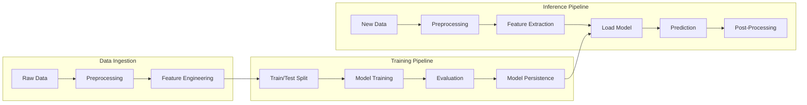

---

### 2.4 Data Access Layer

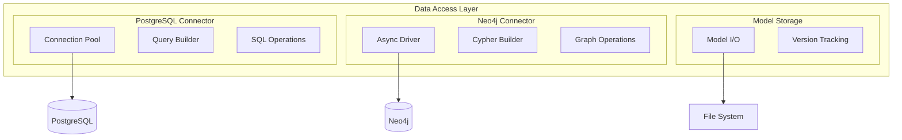

**PostgreSQL Schema Architecture**:

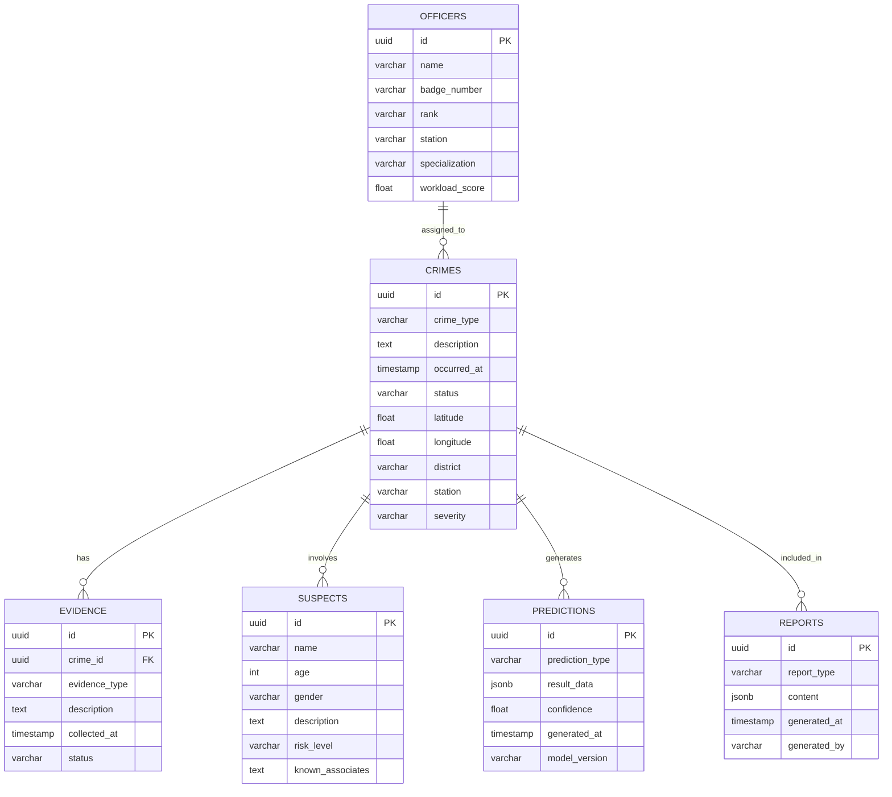

**Neo4j Graph Model**:

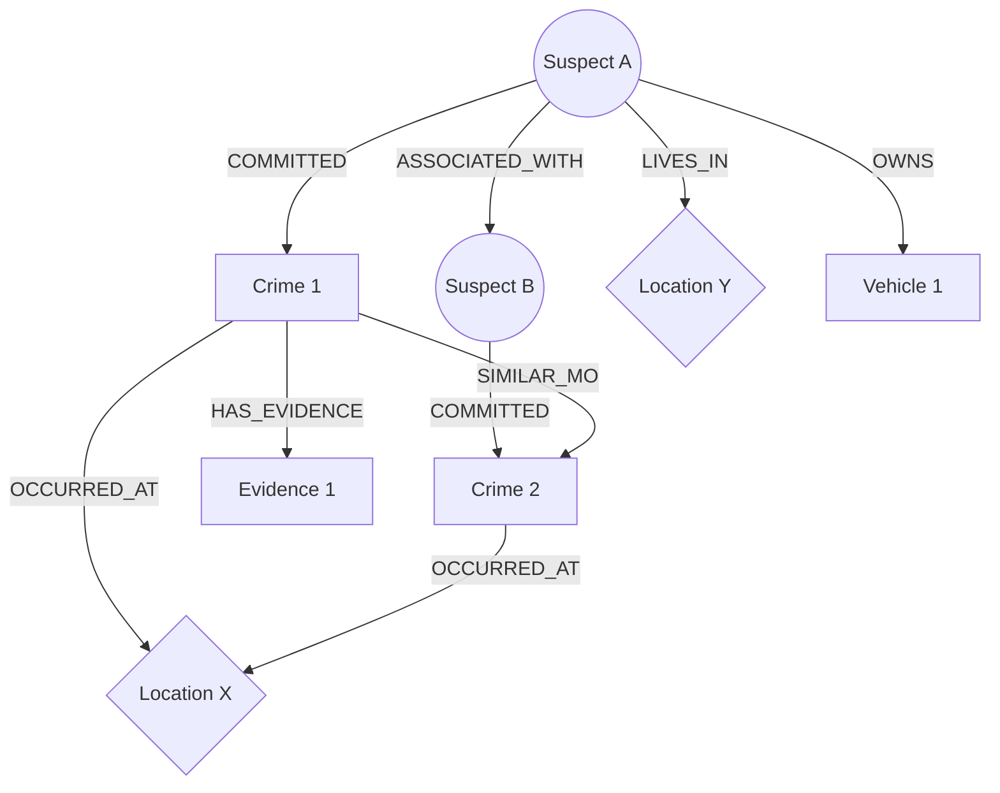

**Node Types**: Suspect, Crime, Location, Evidence, Vehicle, Officer, Station
**Relationship Types**: COMMITTED, ASSOCIATED_WITH, OCCURRED_AT, HAS_EVIDENCE, SIMILAR_MO, ASSIGNED_TO, LIVES_IN, OWNS, WITNESSED

---

## 3. Integration Architecture

### 3.1 Gemini API Integration

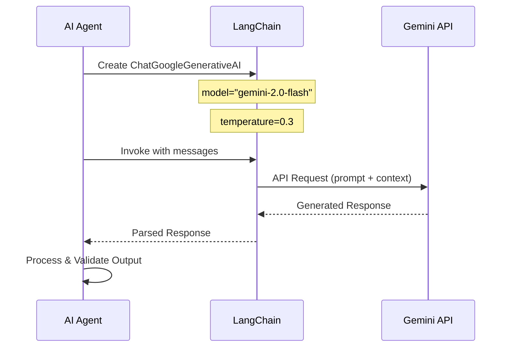

**Integration Pattern**:
- LLM initialization via `langchain_google_genai.ChatGoogleGenerativeAI`
- API key from environment variable `GOOGLE_API_KEY`
- Temperature tuned per agent (investigation=0.2, simulation=0.7)
- Structured output parsing with Pydantic models
- Retry logic with exponential backoff on API failures

### 3.2 LangGraph Workflow Architecture

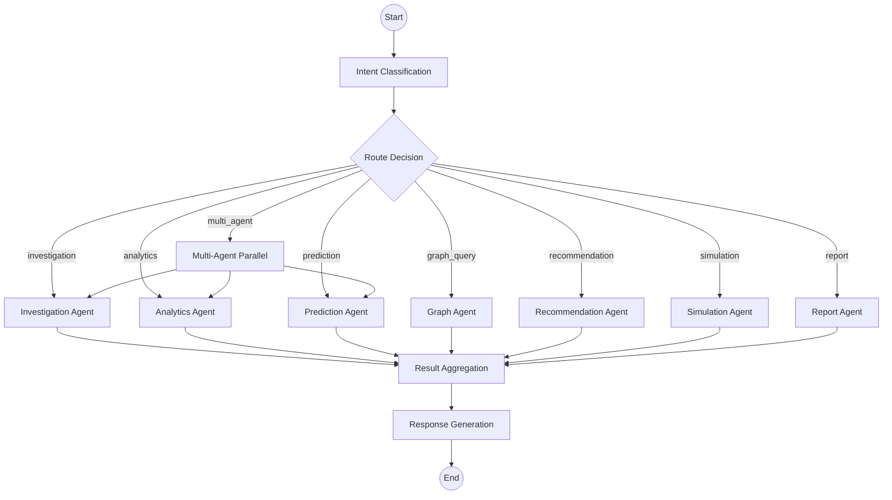

### 3.3 RAG Pipeline Architecture

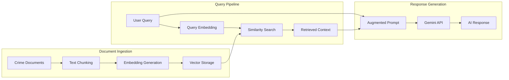

---

## 4. Cross-Module Communication

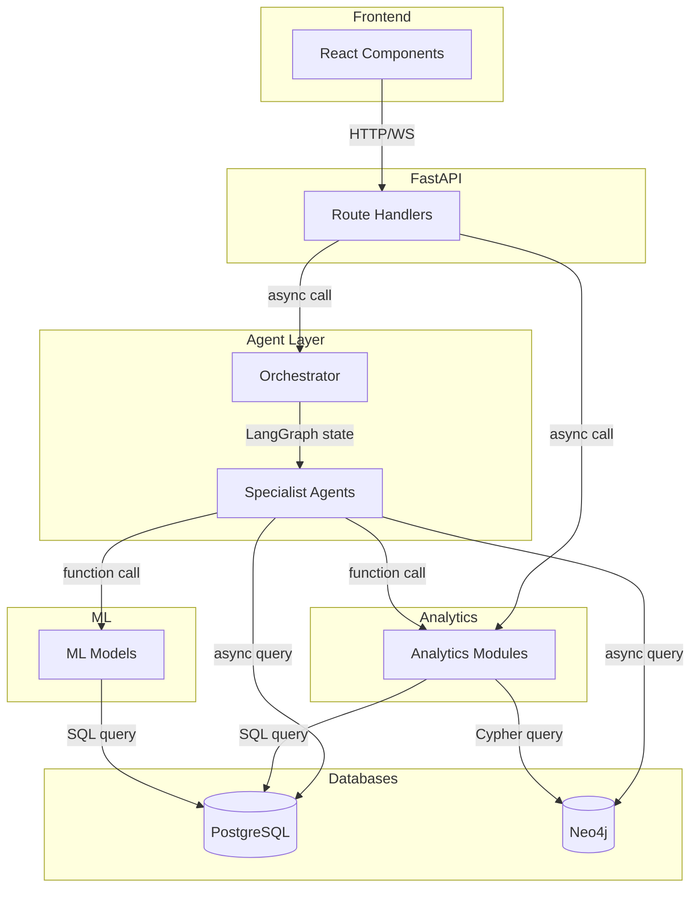

**Communication Protocols**:

| From | To | Protocol | Data Format |
|---|---|---|---|
| Frontend → API | HTTP REST / WebSocket | JSON |
| API → Agents | Async function call | Python dict / TypedDict |
| Orchestrator → Agents | LangGraph state machine | AgentState TypedDict |
| Agents → Analytics | Async function call | Python dict |
| Agents → ML | Async function call | NumPy arrays / DataFrames |
| Agents → PostgreSQL | Async SQL (asyncpg) | SQL result sets |
| Agents → Neo4j | Async Cypher (neo4j driver) | Graph records |
| Agents → Gemini | LangChain invoke | Messages / Strings |
| Analytics → PostgreSQL | Async SQL | SQL result sets |
| Analytics → Neo4j | Async Cypher | Graph records |

---

## 5. Security Architecture

| Layer | Security Measure | Implementation |
|---|---|---|
| **API** | CORS policy | Restrict origins to frontend domain |
| **API** | Rate limiting | Per-IP request throttling |
| **API** | Input validation | Pydantic model validation on all inputs |
| **Database** | Connection pooling | Bounded pool with timeout |
| **Database** | Parameterized queries | Prevent SQL/Cypher injection |
| **AI** | API key management | Environment variables, never in code |
| **AI** | Output sanitization | Validate LLM outputs before returning |
| **Infrastructure** | Docker isolation | Container-level network isolation |

---

## 6. Scalability Considerations

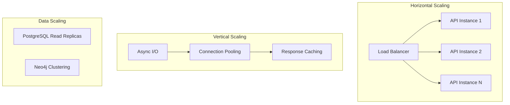

| Concern | Strategy | Implementation |
|---|---|---|
| **API Throughput** | Async handlers + connection pooling | FastAPI + asyncpg |
| **ML Inference** | Model caching + batch prediction | Joblib persistence + batch endpoints |
| **Database Load** | Connection pooling + query optimization | asyncpg pool + indexed queries |
| **AI API Limits** | Rate limiting + request queuing | Custom rate limiter + asyncio.Queue |
| **Memory** | Streaming responses + lazy loading | FastAPI StreamingResponse |

---

## 7. Error Handling Strategy

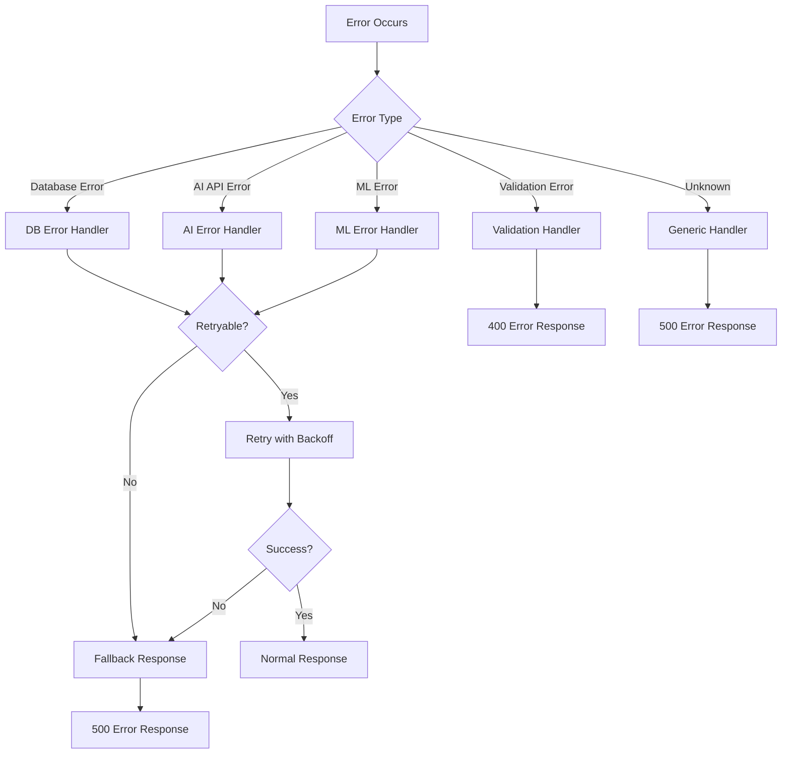

---

*Sentinel AI Architecture — Built for Intelligence, Designed for Scale*
