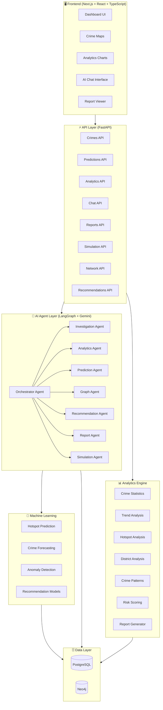
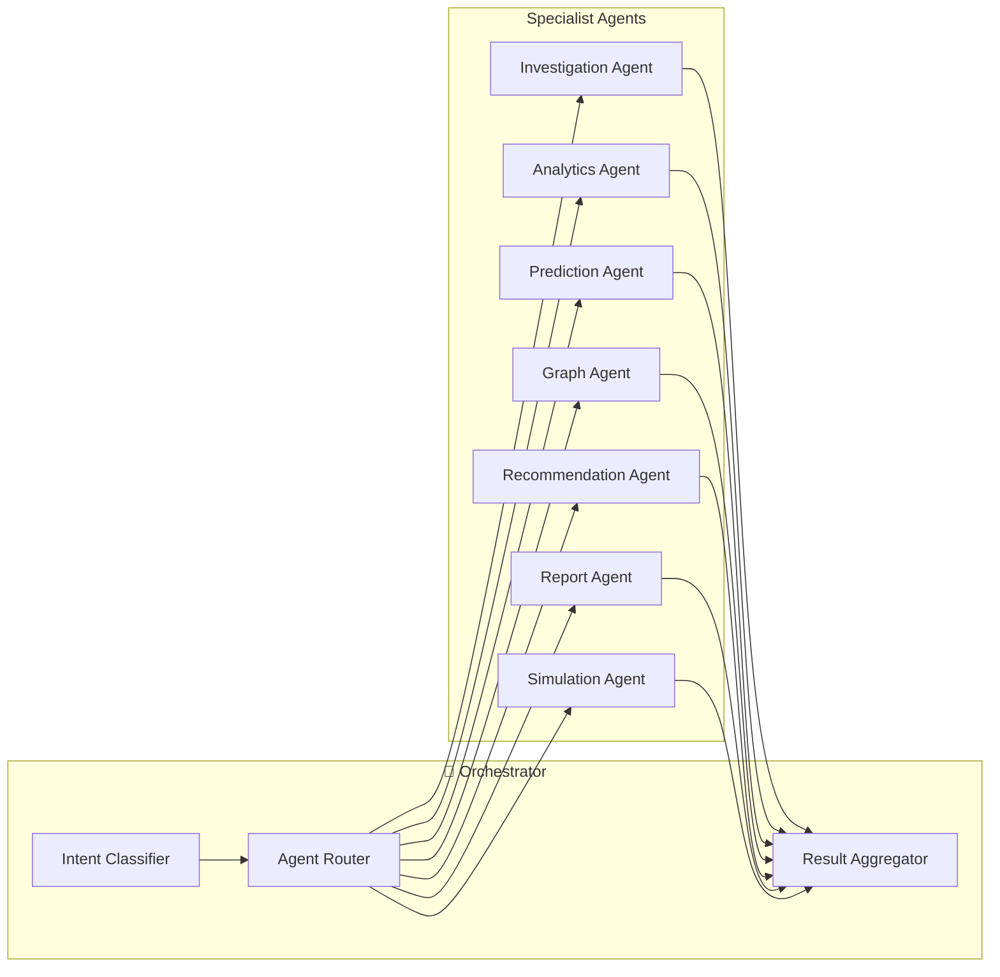
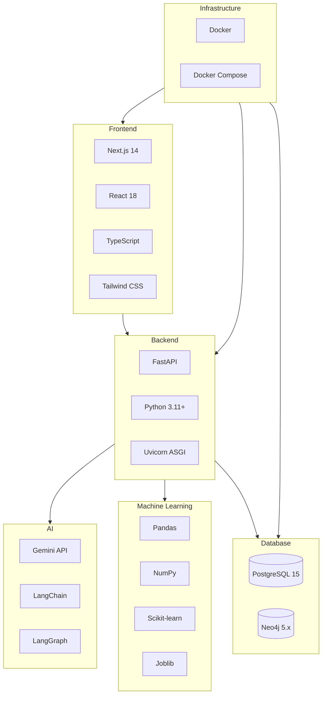
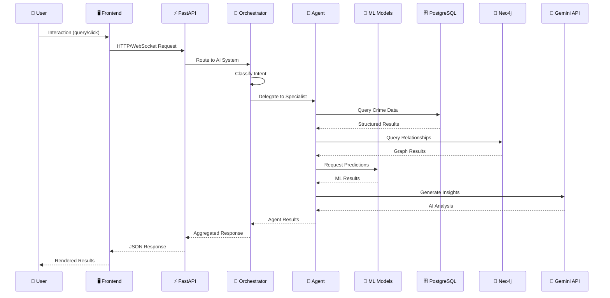
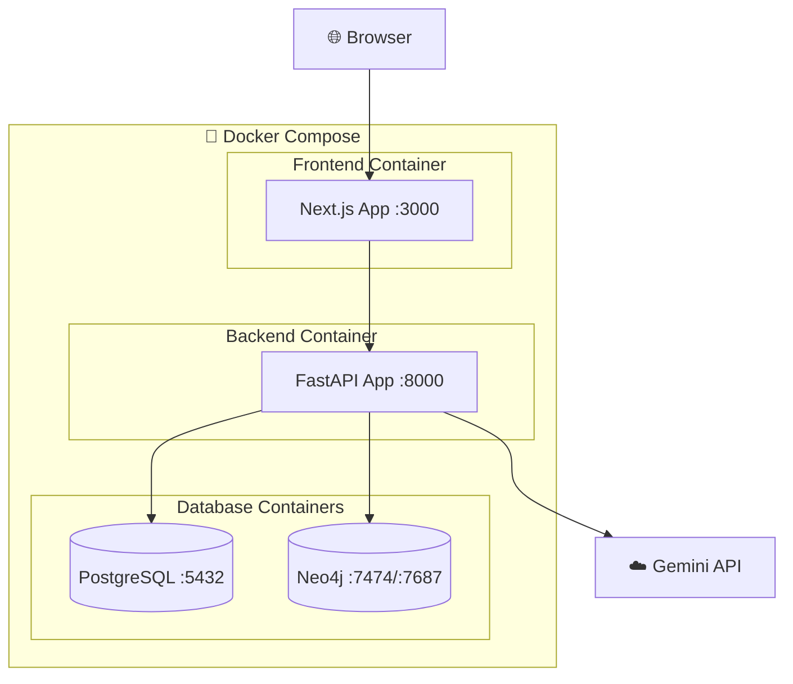

# Sentinel AI — Project Overview

## AI-Powered Crime Intelligence & Decision Operating System

---

## 1. Executive Summary

**Sentinel AI** is an enterprise-grade, AI-powered Crime Intelligence and Decision Operating System designed to transform how law enforcement agencies analyze crime data, predict future incidents, investigate cases, and allocate resources. Built for the **AI Datathon 2026**, Sentinel AI combines cutting-edge machine learning, knowledge graph technology, and multi-agent AI orchestration to deliver actionable crime intelligence in real time.

### Vision Statement

> *"To empower law enforcement with an intelligent operating system that transforms raw crime data into predictive insights, automated investigations, and optimized resource deployment — saving lives through the power of AI."*

### Problem Statement

Indian law enforcement agencies face critical challenges:

- **Data Overload**: Thousands of FIRs, complaints, and reports generated daily across districts with no unified intelligence layer.
- **Reactive Policing**: Officers respond to crimes after they occur rather than preventing them proactively.
- **Disconnected Systems**: Crime records, suspect databases, and patrol schedules exist in silos with no cross-referencing.
- **Manual Analysis**: Crime pattern detection, hotspot identification, and resource allocation rely on human intuition rather than data-driven insights.
- **Investigation Bottlenecks**: Complex cases involving multiple suspects, locations, and evidence chains overwhelm manual investigation workflows.

### Solution

Sentinel AI addresses these challenges through six core capabilities:

| Capability | Description |
|---|---|
| **Crime Intelligence** | Real-time crime analytics with statistical analysis, trend detection, and pattern recognition |
| **Predictive Policing** | ML-powered hotspot prediction, crime forecasting, and anomaly detection |
| **AI Investigation** | Multi-agent AI system that automates evidence analysis, suspect profiling, and case reconstruction |
| **Knowledge Graph** | Neo4j-powered criminal network analysis, entity resolution, and relationship mapping |
| **Resource Optimization** | Officer recommendation engine with patrol routing and workload balancing |
| **Simulation Engine** | What-if scenario modeling for crime prevention strategy evaluation |

---

## 2. High-Level System Architecture



---

## 3. Module Breakdown

### 3.1 Frontend Module

| Component | Technology | Purpose |
|---|---|---|
| Dashboard | Next.js + React | Main command center with real-time crime metrics |
| Crime Maps | Leaflet / Mapbox | Interactive geospatial crime visualization |
| Analytics Charts | Recharts / D3.js | Statistical visualizations and trend graphs |
| AI Chat | WebSocket + React | Natural language crime intelligence queries |
| Report Viewer | PDF.js + React | View and export generated reports |

### 3.2 Backend API Module

| Endpoint Group | Purpose | Key Routes |
|---|---|---|
| `/api/crimes` | Crime data CRUD | GET, POST, PUT, DELETE crime records |
| `/api/predictions` | ML predictions | Hotspot maps, crime forecasts, anomalies |
| `/api/chat` | AI conversation | Natural language queries to agent system |
| `/api/reports` | Report management | Generate, retrieve, export reports |
| `/api/network` | Graph operations | Criminal networks, entity relationships |
| `/api/recommendations` | Resource allocation | Officer assignments, patrol routes |
| `/api/simulation` | Scenario modeling | What-if analysis, impact assessment |

### 3.3 AI Agent Module



| Agent | Responsibility | Key Integrations |
|---|---|---|
| **Orchestrator** | Routes requests to specialist agents, aggregates results | All agents, LangGraph |
| **Investigation** | Automated case investigation and evidence analysis | Neo4j, PostgreSQL, Gemini |
| **Analytics** | Statistical analysis and insight generation | Analytics module, Gemini |
| **Prediction** | ML model orchestration and risk assessment | ML module, Gemini |
| **Graph** | Knowledge graph queries and network analysis | Neo4j, Gemini |
| **Recommendation** | Resource allocation and deployment optimization | ML recommender, Gemini |
| **Report** | Automated report generation | All agents, Gemini |
| **Simulation** | Crime scenario modeling and impact analysis | ML models, Gemini |

### 3.4 Machine Learning Module

| Sub-Module | Models | Purpose |
|---|---|---|
| **Hotspot Prediction** | Random Forest, Gradient Boosting | Predict crime concentration zones |
| **Crime Forecasting** | Time-series regression, lag-based models | Forecast crime counts by district/type |
| **Anomaly Detection** | Isolation Forest, statistical methods | Detect unusual crime patterns |
| **Recommendation** | Multi-criteria scoring, constraint satisfaction | Optimize officer-to-case assignments |

### 3.5 Analytics Module

| Component | Purpose |
|---|---|
| **Crime Statistics** | Descriptive statistics, counts, rates, distributions |
| **Trend Analysis** | Temporal trends, seasonal patterns, change-point detection |
| **Hotspot Analysis** | Spatial density analysis, DBSCAN clustering |
| **District Analysis** | Per-district metrics, comparative performance |
| **Crime Patterns** | MO analysis, serial crime identification |
| **Risk Scoring** | Multi-factor composite risk scores |
| **Report Generator** | Automated report templates with data injection |

### 3.6 Data Layer

| Database | Purpose | Key Use Cases |
|---|---|---|
| **PostgreSQL** | Relational data storage | Crime records, officer data, case files, predictions, reports |
| **Neo4j** | Graph database | Criminal networks, suspect relationships, evidence chains, entity resolution |

---

## 4. Technology Stack



| Layer | Technology | Version | Purpose |
|---|---|---|---|
| **Frontend** | Next.js | 14.x | Server-side rendering, routing |
| | React | 18.x | Component-based UI |
| | TypeScript | 5.x | Type-safe frontend code |
| | Tailwind CSS | 3.x | Utility-first styling |
| **Backend** | FastAPI | 0.104+ | Async REST API framework |
| | Python | 3.11+ | Core backend language |
| | Uvicorn | 0.24+ | ASGI server |
| **AI** | Gemini API | 2.0 | Large Language Model |
| | LangChain | 0.2+ | LLM framework |
| | LangGraph | 0.2+ | Agent orchestration |
| **ML** | Pandas | 2.x | Data manipulation |
| | NumPy | 1.26+ | Numerical computing |
| | Scikit-learn | 1.4+ | ML algorithms |
| **Database** | PostgreSQL | 15.x | Relational storage |
| | Neo4j | 5.x | Graph database |
| **Infrastructure** | Docker | 24.x | Containerization |
| | Docker Compose | 2.x | Multi-container orchestration |

---

## 5. Data Flow Overview



---

## 6. Key Differentiators

| Feature | Traditional Systems | Sentinel AI |
|---|---|---|
| **Analysis** | Manual, retrospective | AI-powered, predictive |
| **Investigation** | Single-officer, linear | Multi-agent, parallel |
| **Data Integration** | Siloed databases | Unified knowledge graph |
| **Resource Allocation** | Experience-based | ML-optimized |
| **Reporting** | Manual, template-based | AI-generated, contextual |
| **Scenario Planning** | Ad-hoc meetings | Simulation engine |

---

## 7. Project Structure

```
sentinel-ai-datathon-2026/
├── frontend/                  # Next.js frontend application
│   ├── src/
│   │   ├── app/              # Next.js app router pages
│   │   ├── components/       # React components
│   │   └── lib/              # Utility libraries
│   └── package.json
├── backend/                   # FastAPI backend
│   ├── agents/               # LangGraph AI agents
│   │   ├── orchestrator.py   # Master agent coordinator
│   │   ├── investigation_agent.py
│   │   ├── analytics_agent.py
│   │   ├── prediction_agent.py
│   │   ├── graph_agent.py
│   │   ├── recommendation_agent.py
│   │   ├── report_agent.py
│   │   ├── simulation_agent.py
│   │   └── prompts.py        # Centralized prompts
│   ├── api/                  # FastAPI route handlers
│   ├── database/             # Database connectors
│   ├── models/               # Pydantic data models
│   └── main.py               # Application entry point
├── ml/                        # Machine learning modules
│   ├── hotspot_prediction/   # Crime hotspot ML
│   ├── crime_forecasting/    # Time-series forecasting
│   ├── anomaly_detection/    # Anomaly detection
│   ├── recommendation_models/ # Officer recommendation
│   └── utils/                # Shared ML utilities
├── analytics/                 # Analytics engine
│   ├── crime_statistics.py
│   ├── trend_analysis.py
│   ├── hotspot_analysis.py
│   ├── district_analysis.py
│   ├── crime_pattern.py
│   ├── risk_score.py
│   └── report_generator.py
├── datasets/                  # Data files
│   ├── raw/                  # Raw datasets
│   └── processed/            # Processed datasets
├── docs/                      # Documentation
├── architecture/              # Architecture diagrams
├── research/                  # Research notes
├── docker-compose.yml         # Container orchestration
└── requirements.txt           # Python dependencies
```

---

## 8. Deployment Architecture



---

## 9. Success Metrics

| Metric | Target |
|---|---|
| Hotspot prediction accuracy | ≥ 85% |
| Crime forecast MAE | ≤ 15% |
| Anomaly detection precision | ≥ 80% |
| Agent response time | < 5 seconds |
| System uptime | 99.9% |
| Report generation time | < 10 seconds |

---

*Sentinel AI — Transforming Crime Data into Actionable Intelligence*
