# Sentinel AI — Workflow Documentation

## End-to-End Workflow Reference

---

## 1. System Workflow Overview

Sentinel AI operates through six primary workflows that cover the complete spectrum of crime intelligence operations.

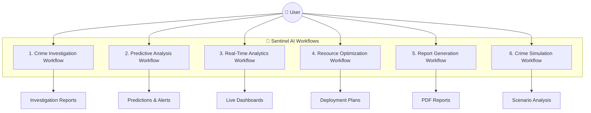

---

## 2. Crime Investigation Workflow

### 2.1 Flow Overview

This workflow handles end-to-end automated crime investigation, from initial case intake to final investigation report generation.

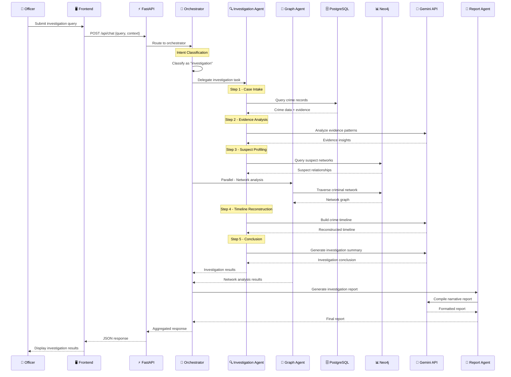

### 2.2 Data Flow

| Step | Source | Processing | Destination |
|---|---|---|---|
| Case Intake | PostgreSQL | SQL query for crime + evidence | Investigation Agent |
| Evidence Analysis | Agent state | Gemini prompt with evidence context | Agent state (insights) |
| Suspect Profiling | Neo4j | Cypher query for relationships | Agent state (suspects) |
| Network Analysis | Neo4j | Graph traversal + community detection | Graph Agent results |
| Timeline | Agent state | Gemini chronological reconstruction | Agent state (timeline) |
| Conclusion | All results | Gemini synthesis of findings | Final report |

---

## 3. Predictive Analysis Workflow

### 3.1 Flow Overview

This workflow generates crime predictions using ML models and enriches them with AI-powered risk assessment.

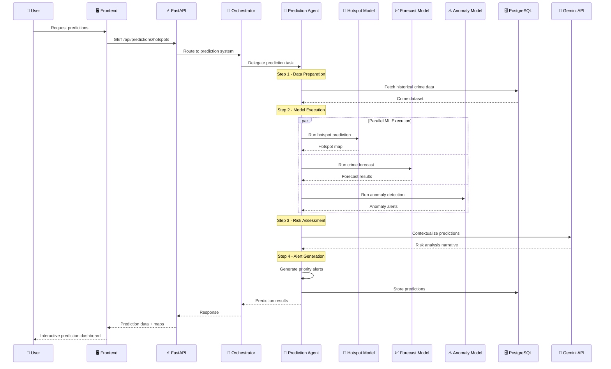

### 3.2 ML Model Pipeline

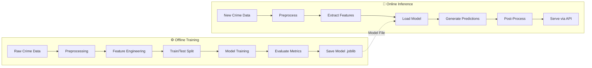

---

## 4. Real-Time Analytics Workflow

### 4.1 Flow Overview

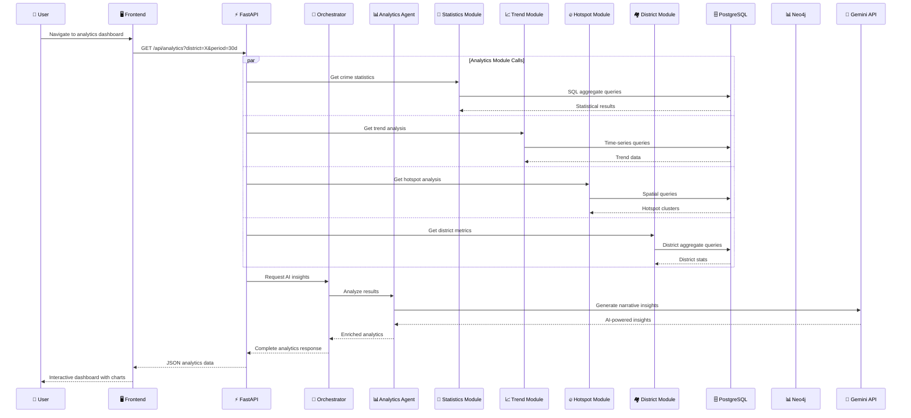

### 4.2 Analytics Module Interactions

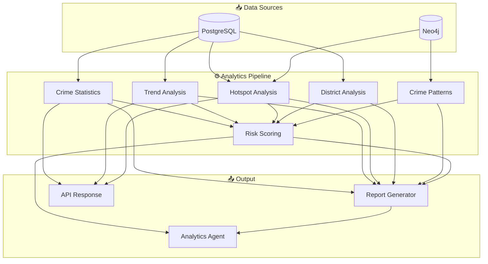

---

## 5. Resource Optimization Workflow

### 5.1 Flow Overview

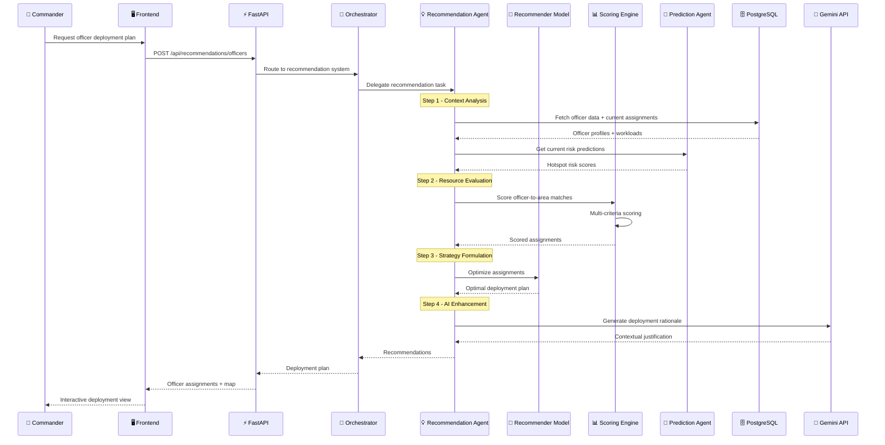

### 5.2 Scoring Criteria

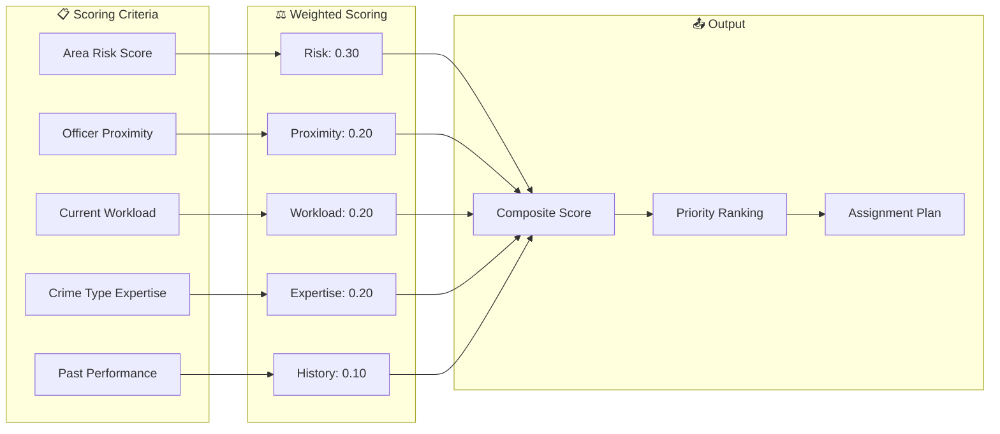

---

## 6. Report Generation Workflow

### 6.1 Flow Overview

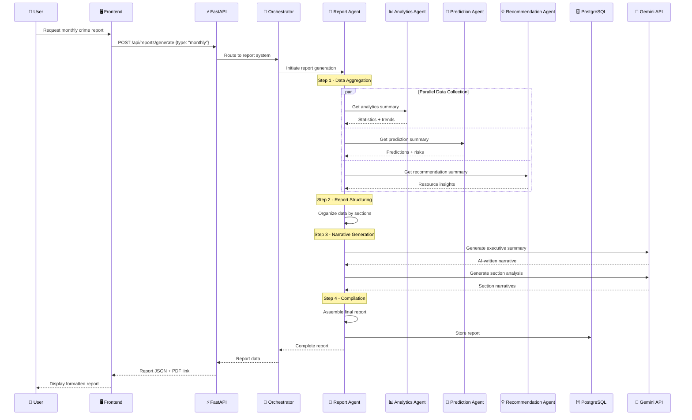

---

## 7. Crime Simulation Workflow

### 7.1 Flow Overview

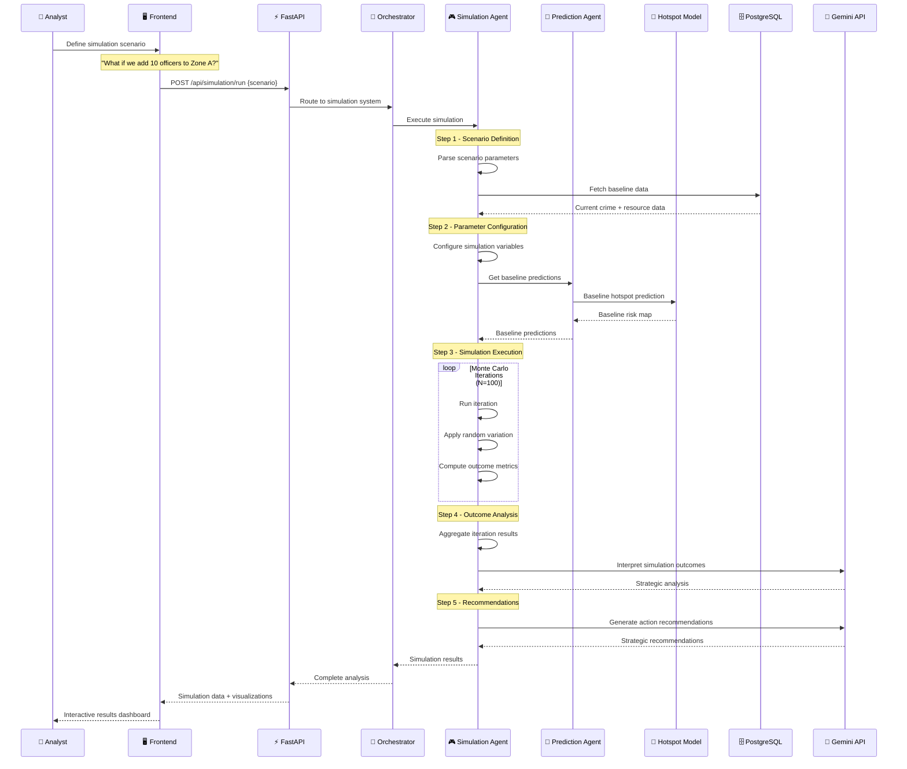

### 7.2 Simulation Parameters

| Parameter | Type | Description | Example |
|---|---|---|---|
| `officer_delta` | int | Change in officer count per zone | +10, -5 |
| `patrol_frequency` | float | Patrol frequency multiplier | 1.5x |
| `target_zones` | list | Zones affected by change | ["Zone A", "Zone B"] |
| `duration_days` | int | Simulation time horizon | 30, 90, 180 |
| `crime_types` | list | Crime types to simulate | ["theft", "assault"] |
| `confidence_level` | float | Statistical confidence | 0.95 |
| `iterations` | int | Monte Carlo iterations | 100, 500, 1000 |

---

## 8. Cross-Workflow Integration

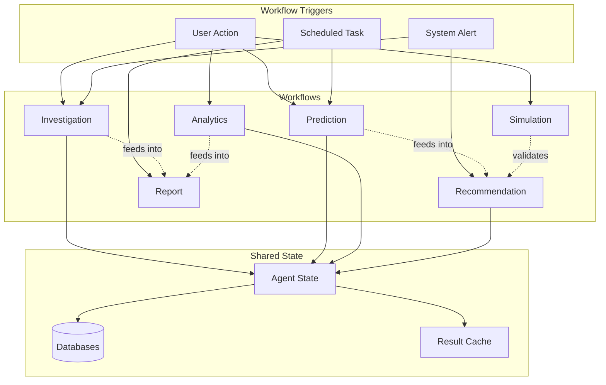

**Workflow Dependencies**:

| Workflow | Depends On | Feeds Into |
|---|---|---|
| Investigation | Graph Agent, PostgreSQL, Neo4j | Report Generation |
| Prediction | ML Models, Historical Data | Recommendation, Simulation |
| Analytics | PostgreSQL, Neo4j | Report, Recommendation |
| Recommendation | Prediction, Analytics | Simulation (validation) |
| Report | All other workflows | User consumption |
| Simulation | Prediction, Historical Data | Recommendation |

---

*Sentinel AI Workflows — From Data to Decision*
